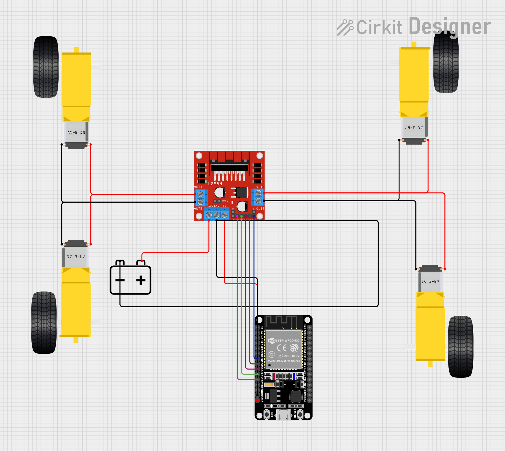

# 📘 Pertemuan 01 — Rakit Mobil IoRT Dasar

## 🚗 Topik
Merakit mobil prototype menggunakan:
- 4x Motor DC
- Driver Motor L298N
- ESP32
- Case baterai AA (4 butir)
- Modul kit mobil 4 motor DC

## 🎯 Tujuan
- Menyusun rangkaian pin I/O ESP32 ke L298N
- Menyambungkan sumber daya ke driver dan ESP32
- Menjalankan tes gerakan: maju, mundur, belok kiri/kanan, berhenti

## 🧪 Tahapan
1. **Tes koneksi ESP32 + PlatformIO**
   - LED blinking
   - Serial monitor
2. **Rakit rangkaian fisik**
   - Motor → Driver
   - Baterai → Driver
   - Driver → ESP32
   - Daya → ESP32
3. **Tes gerakan mobil**
   - Maju, mundur, belok kiri/kanan, berhenti

## 📄 File Terkait
- [`tugas.md`](tugas.md): instruksi dosen
- [`diagram-pin.md`](diagram-pin.md): wiring ESP32 ke L298N
- [`src/main.cpp`](../src/main.cpp): kode kontrol motor

## 📸 Dokumentasi Visual

### 🔧 Diagram Rangkaian

### 📷 Foto Rangkaian & Uji Coba
> Format `.HEIC` tidak bisa ditampilkan langsung di GitHub. File disimpan sebagai arsip dan bisa diunduh.

- [`DOC01.HEIC`](assets/DOC01.HEIC) — Rangkaian motor ke driver
- [`DOC02.HEIC`](assets/DOC02.HEIC) — Rangkaian baterai ke driver
- [`DOC03.HEIC`](assets/DOC03.HEIC) — Rangkaian driver ke ESP32

### 🎥 Video Demo Mobil Bergerak
> Format `.mp4` tidak bisa diputar langsung di GitHub repo view. Gunakan link berikut untuk mengunduh atau putar di lokal:

- [`DEMO.mp4`](assets/DEMO.mp4)

---

## 🧠 Catatan Tambahan
- Semua wiring mengikuti konfigurasi di `diagram-pin.md`
- Tes gerakan dilakukan otomatis via fungsi `loop()` di `main.cpp`
- Dokumentasi ini akan menjadi referensi untuk pertemuan berikutnya (Bluetooth, Web Server, Sensor)

---
