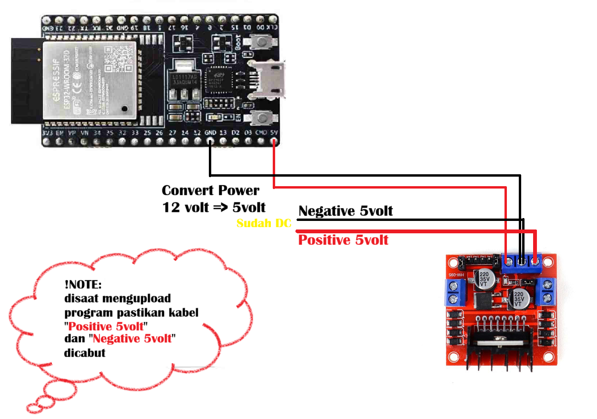

# 📘 Pertemuan 02 — Kontrol Mobil via Bluetooth

## 📡 Topik
Menambahkan fitur kontrol mobil menggunakan komunikasi Bluetooth dari smartphone ke ESP32.

## 🎯 Tujuan
- Mengaktifkan Bluetooth Serial di ESP32
- Menerima perintah karakter dari aplikasi Bluetooth
- Menghubungkan perintah ke fungsi gerakan: maju, mundur, belok, berhenti

## 🧪 Tahapan
1. Setup Bluetooth Serial di ESP32
2. Pairing dengan aplikasi [Serial Bluetooth Terminal](https://play.google.com/store/apps/details?id=de.kai_morich.serial_bluetooth_terminal&pcampaign)
3. Mapping karakter ke fungsi gerakan
4. Tes kontrol manual via HP

## 📄 File Terkait
- [`tugas.md`](tugas.md): instruksi dosen dan catatan teknis
- [`diagram-bluetooth.md`](diagram-bluetooth.md): wiring dan alur komunikasi
- [`src/main.cpp`](../src/main.cpp): kode kontrol Bluetooth

## 📸 Dokumentasi Visual

### 🔧 Diagram Rangkaian Bluetooth

### 🎥 Video Demo Kontrol Bluetooth
> [!NOTE]
> Demo setup device mengontrol dengan via bluetooth dengan memakai platform aplikasi [`Serial Bluetooth Terminal`](https://play.google.com/store/apps/details?id=de.kai_morich.serial_bluetooth_terminal&pcampaign)
> <video src="assets/DEMO02.1.mp4" width="500" height="500" controls></video>

> [!NOTE]
> Demo mengontrol mobil memakai platform aplikasi [`Serial Bluetooth Terminal`](https://play.google.com/store/apps/details?id=de.kai_morich.serial_bluetooth_terminal&pcampaign)
> <video src="assets/DEMO02.2.mp4" width="500" height="500" controls></video>

---

## 🧠 Catatan Tambahan
- Nama Bluetooth device: `Mobil_IoRT_GACOR`
- Pastikan koneksi power stabil dan tidak overcurrent
- Gunakan kabel jumper berkualitas dan cek polaritas sebelum upload program

---
