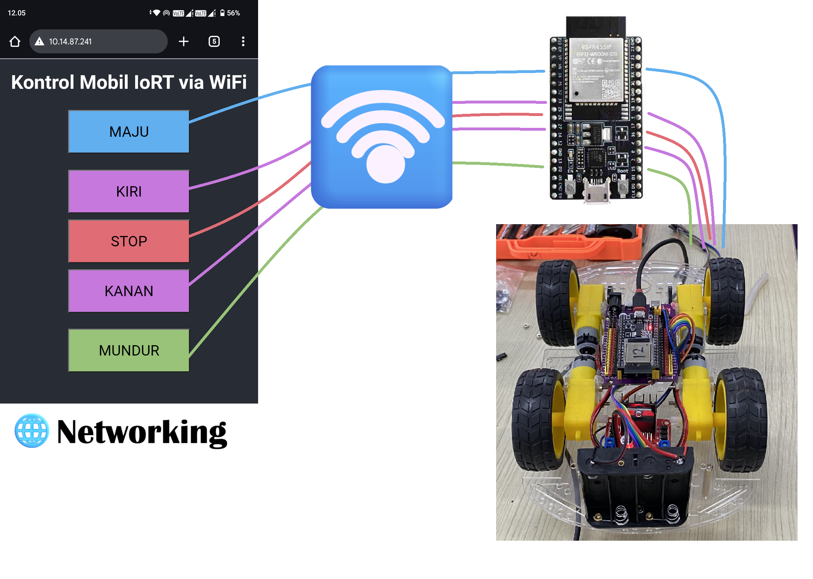

# 📘 Pertemuan 03 — Kontrol Mobil via Web Server ESP32

## 🌐 Topik
Menambahkan kontrol mobil menggunakan Web Server ESP32 yang dapat diakses melalui browser.

## 🎯 Tujuan
- Mengaktifkan koneksi WiFi pada ESP32
- Menyediakan halaman web dengan tombol kontrol
- Menangani request URL untuk gerakan mobil

## 🧪 Tahapan
1. Setup koneksi WiFi ESP32
2. Menyediakan halaman HTML responsif
3. Mapping URL ke fungsi gerakan
4. Tes kontrol via browser

## 📄 File Terkait
- [`tugas.md`](tugas.md): instruksi dosen dan catatan teknis
- [`diagram-webserver.md`](diagram-webserver.md): wiring dan alur komunikasi
- [`src/main.cpp`](../src/main.cpp): kode kontrol Web Server

## 📸 Dokumentasi Visual

### 🔧 Diagram Rangkaian Web Server

---

## 🧠 Catatan Tambahan
- Ganti `ssid` dan `password` sesuai jaringan lokal
- Pastikan koneksi stabil sebelum upload program
- Tes kontrol bisa dilakukan dari HP atau laptop

---
